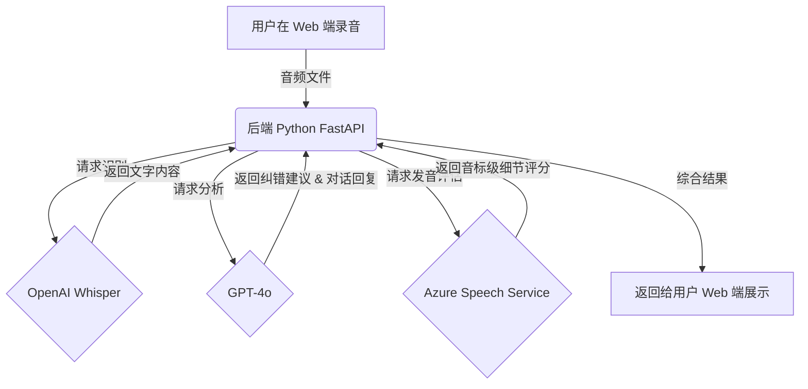

# AI 英语学习助手 - 数据流与接口说明 (Data Flow & APIs) v1.0

这一份文档是给开发人员看的“施工图”，它描述了当你对着屏幕说一句话时，后台是如何一步步处理并给你反馈的。

## 1. 核心流程图 (The Workflow)

## 2. 关键接口 (Integration Points)

### 2.1 语音转文字 (STT)
- **选择**: OpenAI Whisper API.
- **输入**: 用户录制的 `.webm` 或 `.wav` 音频。
- **输出**: 转录后的英文文本。

### 2.2 智能对话与纠错 (Brain)
- **选择**: GPT-4o (`chat/completions`).
- **指令 (Prompt)**: 
  > 你是一位非常有耐心的英语外教。用户是几乎零基础的成年人。
  > 1. 请纠正用户输入中的语法错误。
  > 2. 给出一个更地道、但同样简单的表达。
  > 3. 继续当前的场景模拟对话。
- **格式**: 返回 JSON 数据，包含 `corrected_text` (修正后的文字) 和 `ai_response` (AI 的回复)。

### 2.3 发音评估 (Assessment)
- **选择**: Azure Cognitive Services - Pronunciation Assessment.
- **输入**: 用户原始音频 + 目标句子文本（GPT 提供的标准句子）。
- **输出**: 
  - **Accuracy Score**: 发音准确度。
  - **Phoneme Detail**: 每个音节的读音是否正确（通过 IPA 音标展示）。
  - **Prosody Score**: 语调和重音得分。

## 3. 数据存储结构 (Database)
- **User Profile**: 记录初次 GSE 测评得分、年龄、学习目标。
- **Word Bank**: 记录用户在对话中出现的所有“错词”，打上“待重训”标签。
- **Chat Logs**: 保存完整的对话历史，用于 AI 分析长期进步。

## 4. 给你的建议
这套流程确保了你的软件不仅能“听懂”，还能“看透”发音中的微小错误，并像真人一样对话。
存储方案建议使用 **PostgreSQL**，它是目前行业最稳健的选择。
