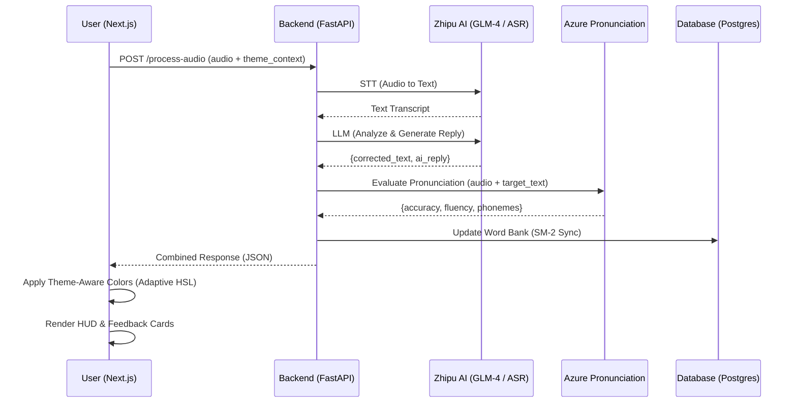
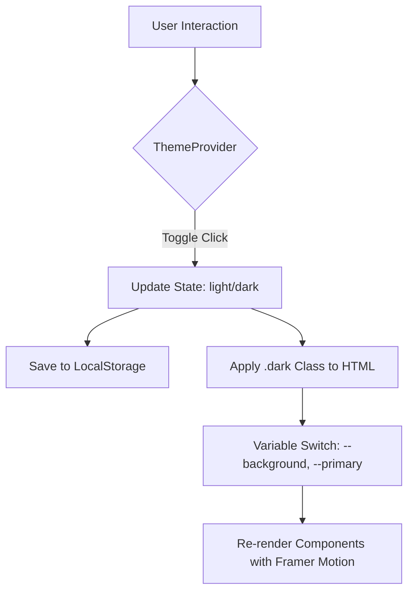

# AI English Learn - Workflow Maps (v2.0)

## 1. The "Magic Loop" (Audio & Theme-Aware Processing)
This sequence diagram describes the round-trip from the user's voice to AI feedback, including theme-aware rendering.

## 2. Theme Orchestration Flow
How the system manages the "Solar" vs "Digital" state.

## 3. Spaced Repetition (SM-2) Logic
How the "Word Bank" decides when to show a word again.

1.  ** মাস্টারি লেভেল (Mastery Stage)**: 评分 0-100 映射至 0-5 级。
2.  ** Interval Calculation**: 
    - 级 3+: $I(n) = I(n-1) \times E$
    - 级 0-2: $I(n) = 1$ 天
3.  ** Topic-Based Prioritization**: 实时从对话场景中提取关键词，优先展示词库中语义相关的待完成单词。
